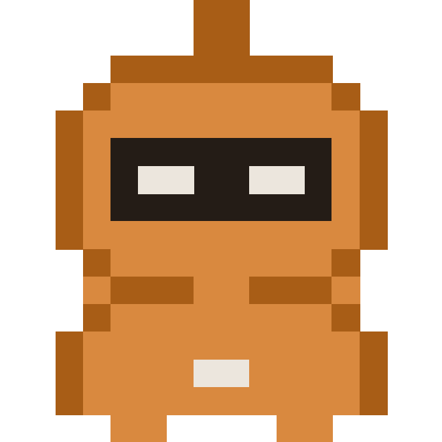

# Hi, I'm Amaan

I build AI agents that find customers. I'm the founder of [Otto Pilot](https://otto-pilot.io), based in London.

Before I wrote code I sold for a living: £1.4M+ in new revenue at Terrapinn, and enterprise deals with Microsoft, the NHS and Audi at a startup I co-founded and exited. Then an MSc at LSE (Distinction), and now I build the tools I wish I'd had.

## What I'm building

**[Otto Pilot](https://otto-pilot.io)** is a go-to-market engine for B2B teams.
- Finds the companies that fit your ICP and the right people at each one
- 25+ Signal Agents watch your accounts for the moment to reach out: a new leader, a relevant hire, fresh funding
- Runs LinkedIn and email campaigns that only go out once you approve them, then sorts and drafts the replies
- An MCP server, so Claude can run all of it from a chat

**[agentic-gtm](https://github.com/Amaan-creates/agentic-gtm)** is an open-source Claude skill that teaches founders how to find customers. Give it your startup's URL and it builds a short course on your own market, then hands you a scheduled agent on Claude Managed Agents. Built at the Claude Founder House. Examples: [Tennr](https://amaan-creates.github.io/agentic-gtm/examples/tennr/course.html), [Greptile](https://amaan-creates.github.io/agentic-gtm/examples/greptile/course.html), [Lindus Health](https://amaan-creates.github.io/agentic-gtm/examples/lindus-health/course.html).

## What I'm working on next

- **Knowing when to reach out.** More ways to spot the moment a company is ready to talk.
- **Trust in the data.** Making sure every person and company Otto finds is current and correct.
- **More channels.** Reaching the same buyers wherever they spend their time.

## At LSE

MSc Management of Information Systems and Digital Innovation, Distinction (2024–25). Modules included Managing AI, Open Innovation and IT and Service Innovation.

- **MediLink** (group project, IT and Service Innovation). Healthcare access for rural Rwanda through two channels: a mobile app, and USSD for phones with no internet. It connects patients, clinics and drone delivery. We wrote the full product spec (user flows, UML, data and infrastructure, roadmap, ethics and law) and a VC pitch deck.
- **Second Bite** (group project, Managing AI). An AI-enabled two-sided platform that matches surplus food from London businesses with charities. It forecasts donation volumes and allocates food by perishability, charity capacity and local need, with a governance and ethics design for the models.
- **Code camp.** A Python voice assistant built on the ChatGPT and ElevenLabs APIs, applied to financial modelling.

## Before that

- **Terrapinn**, business development (2021–24). £1.4M+ in new sponsorship revenue with renewals above 85%. Grew MOVE America from 45 attendees in 2021 to 5,000 in 2024.
- **Swizio**, co-founder and sales director (2020–24). B2B SaaS for contactless networking at events, with a Salesforce integration that synced leads captured at conferences. Clients included Microsoft, the NHS and Audi. Exited in 2024.

## Tools I use

Claude Code, Claude Managed Agents, MCP, TypeScript, Python, Cloudflare Workers, Supabase.

Certificates from Anthropic: AI Fluency: Framework & Foundations, Claude 101, Claude with Google Vertex AI.

## Say hello

[LinkedIn](https://www.linkedin.com/in/amaan-aslam-078b33176/) · [otto-pilot.io](https://otto-pilot.io) · amaanaslam1999@gmail.com
